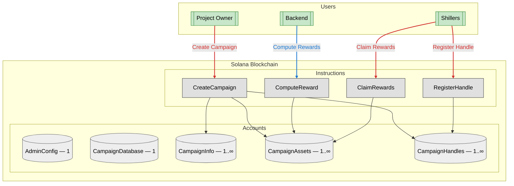
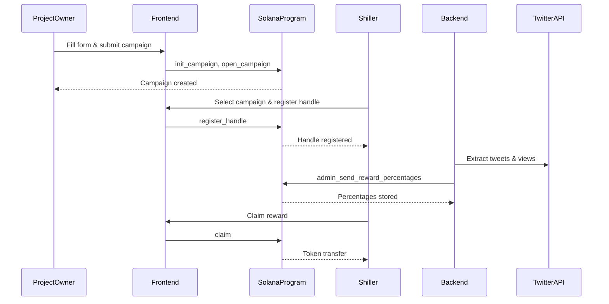

# Shilltok campaign contract

## Overall architecture

```mermaid
graph TD
    %% Solana Blockchain
    subgraph Solana Blockchain
        %% Solana Instructions
        subgraph Instructions
            direction TB
            CreateCampaign[CreateCampaign]
            RegisterHandle[RegisterHandle]
            ComputeReward[ComputeReward]
            ClaimRewards[ClaimRewards]
        end

        %% Solana Accounts
        subgraph Accounts
            direction TB
            AdminConfig[(AdminConfig — 1)]
            CampaignDatabase[(CampaignDatabase — 1)]
            CampaignInfo[(CampaignInfo — 1..∞)]
            CampaignAssets[(CampaignAssets — 1..∞)]
            CampaignHandles[(CampaignHandles — 1..∞)]
        end
    end

    %% Users
    subgraph Users
        direction TB
        ProjectOwner[[Project Owner]]
        Shillers[[Shillers]]
        Backend[[Backend]]
    end

    %% User Interactions
    ProjectOwner -- Create Campaign --> CreateCampaign
    Shillers -- Register Handle --> RegisterHandle
    Shillers -- Claim Rewards --> ClaimRewards
    Backend -- Compute Rewards --> ComputeReward

    %% Instructions Interactions with Accounts (excluding AdminConfig and CampaignDatabase arrows)
    CreateCampaign --> CampaignInfo
    CreateCampaign --> CampaignAssets
    CreateCampaign --> CampaignHandles

    RegisterHandle --> CampaignHandles
    ComputeReward --> CampaignAssets
    ClaimRewards --> CampaignAssets

    %% Styling
    classDef instruction fill:#e0e0e0,stroke:#424242,stroke-width:1px,color:#000000
    classDef account fill:#eeeeee,stroke:#616161,stroke-width:1px,color:#000000
    classDef user fill:#c8e6c9,stroke:#388e3c,stroke-width:1px,color:#000000
    classDef frontendLink stroke:#d32f2f,stroke-width:2px,color:#d32f2f
    classDef backendLink stroke:#1976d2,stroke-width:2px,color:#1976d2

    class CreateCampaign,RegisterHandle,ComputeReward,ClaimRewards instruction
    class AdminConfig,CampaignDatabase,CampaignInfo,CampaignAssets,CampaignHandles account
    class ProjectOwner,Shillers,Backend user

    linkStyle 0 stroke:#d32f2f,stroke-width:2px,color:#d32f2f
    linkStyle 1 stroke:#d32f2f,stroke-width:2px,color:#d32f2f
    linkStyle 2 stroke:#d32f2f,stroke-width:2px,color:#d32f2f
    linkStyle 3 stroke:#1976d2,stroke-width:2px,color:#1976d2
```

## Sequence diagram

```mermaid
sequenceDiagram
    participant PO as ProjectOwner
    participant Frontend
    participant Contract as SolanaProgram
    participant SH as Shiller
    participant BE as Backend

    PO->>Frontend: Fill form & submit campaign
    Frontend->>Contract: init_campaign, open_campaign
    Contract-->>PO: Campaign created

    SH->>Frontend: Select campaign & register handle
    Frontend->>Contract: register_handle
    Contract-->>SH: Handle registered

    BE->>TwitterAPI: Extract tweets & views
    BE->>Contract: admin_send_reward_percentages
    Contract-->>BE: Percentages stored

    SH->>Frontend: Claim reward
    Frontend->>Contract: claim
    Contract-->>SH: Token transfer
```
